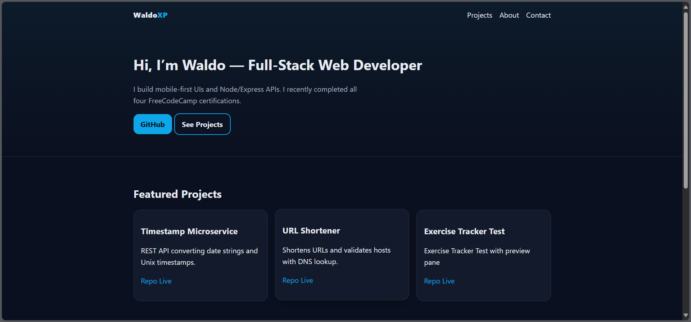
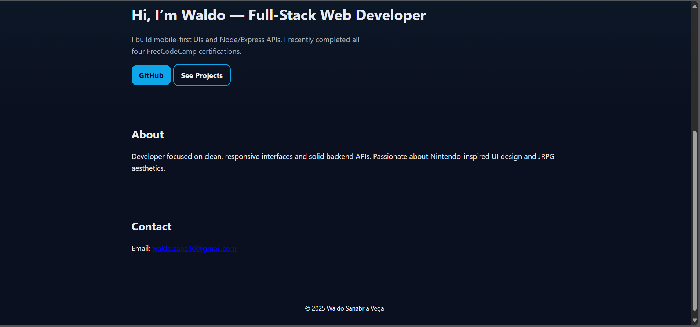

# WaldoXP — Personal Portfolio

A clean, FCC-compliant personal portfolio site showcasing my projects and Nintendo‑inspired design touches.

> **Live Demo:** https://GalladeX3.github.io/  
> **Built For:** freeCodeCamp – _Responsive Web Design: Personal Portfolio Webpage_

---

## 📸 Screenshots

Place your screenshots in a `docs/` folder and they will render here:




> **Tip:** If images don’t show up on GitHub, make sure the filenames and paths match **exactly** (case-sensitive).

**Add images from terminal:**
```bash
mkdir -p docs
# move or copy your PNG/JPG files into ./docs
git add docs/portfolio-waldoxp.png docs/portfolio-waldoxp-2.png
git commit -m "docs: add portfolio screenshots"
git push
```

If you prefer HTML (for centering), use **valid** tags (don’t forget the closing `>`):
```html
<div align="center">
  
  
</div>
```

---

## ✅ FreeCodeCamp User Stories Covered

- A **navbar** with `id="navbar"` that is **fixed** to the top.
- A **welcome section** with `id="welcome-section"` whose height is at least the **full viewport height**.
- A **projects** section with `id="projects"` containing one or more elements with the class **`project-tile`** that link to projects.
- A link to my profile (GitHub) with `id="profile-link"` that **opens in a new tab**.
- Navigation links that jump to the respective sections on the page.
- All FCC test suite checks pass for the Personal Portfolio Webpage project.

---

## 🧰 Tech Stack

- **HTML5** semantic structure, accessible landmarks & skip link
- **CSS3** with design tokens (CSS variables), fluid `clamp()` typography, responsive grid
- **Dark mode** support via `prefers-color-scheme`
- Deployed with **GitHub Pages**

---

## 🚀 Getting Started (Local)

Clone and open locally:

```bash
git clone https://github.com/GalladeX3/GalladeX3.github.io
cd GalladeX3.github.io
```

Open `index.html` directly in a browser **or** run a quick local server:

```bash
# using Node's http-server (auto-opens browser)
npx http-server . -p 8080 -o
# then visit: http://localhost:8080
```

> **Note:** The HTML links the stylesheet as `style.css` (lowercase). Make sure your file is named exactly `style.css` (case-sensitive).

---

## 🌐 Deployment (GitHub Pages)

- If this repo is `GalladeX3.github.io`, pushing to `main` publishes to **https://GalladeX3.github.io/**.
- If this is a project repo (e.g. `personal-portfolio`), enable **Settings → Pages** → “Deploy from branch” → `main` → `/root`.  
  Your URL will be **https://GalladeX3.github.io/personal-portfolio/**.

---

## 📁 Project Structure

```
.
├── index.html
├── style.css
├── docs/
│   ├── portfolio-waldoxp.png
│   └── portfolio-waldoxp-2.png
└── (other assets as needed)
```

---

## ✨ Features

- Smooth scrolling, fixed nav, and accessible focus styles
- Nintendo‑red accent and subtle gradient hero
- Responsive cards grid for project tiles
- Clean metadata (description, canonical, Open Graph) in the HTML

---

## 📝 Notes

- Replace placeholder project links in the “My Projects” grid with your real URLs.
- Keep images optimized (1080–1600px wide, ~200–500KB) for faster page loads.

---

## 📄 License

MIT © Waldo Sanabria (WaldoXP)
